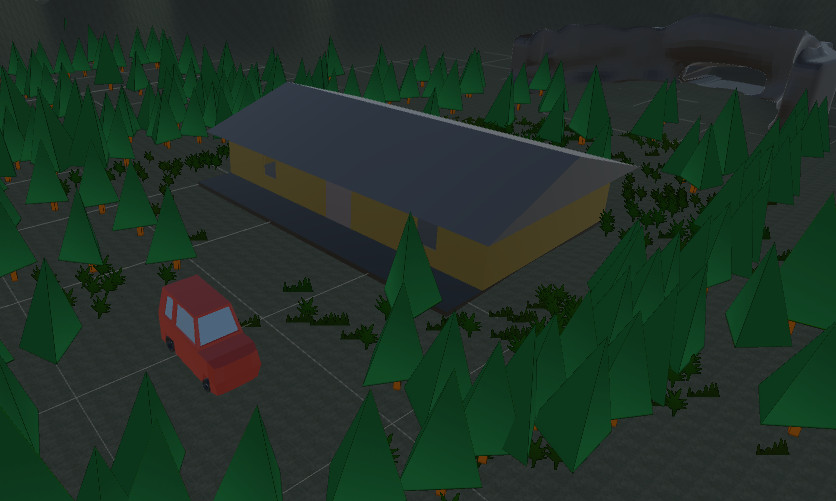
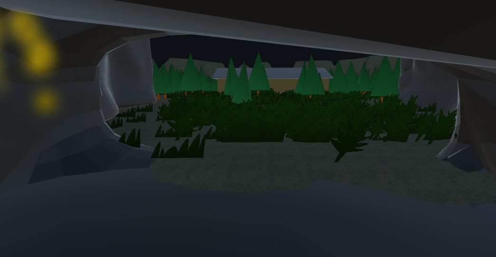
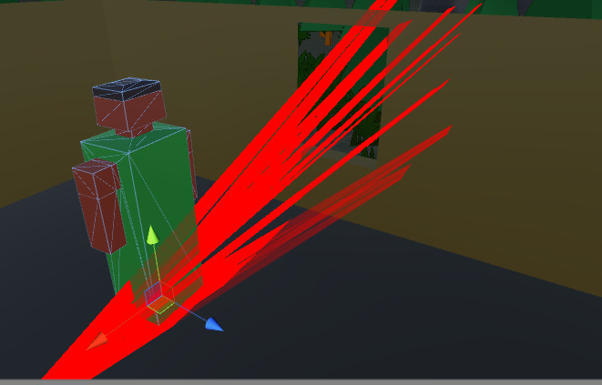
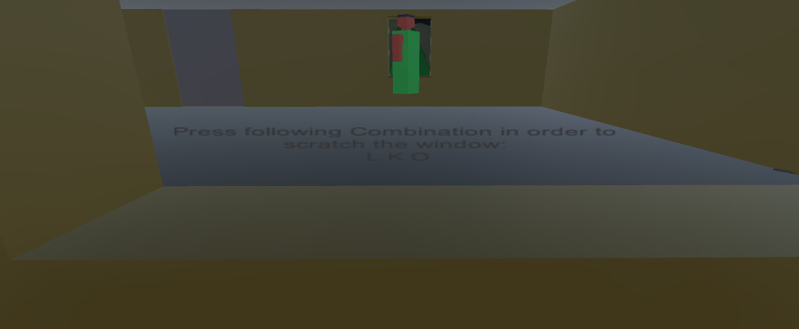

# Review of my first ludum dare

Dear all,

it has been very interesting days during the competition! Sadly I didn't finish my game, but despite of throwing the towel, I was very happy to participate on this event and I hope it will not be the last time.

Anyhow I would like to share my experience and the game prototype I had.

After a relative short period of time I came up with my idea:

*The story is a typical teenage horror movie and you play the monster. You have sleept over many hundred years and now the time has to come to awake. And you have to scare teenager in order to gain energy and win the game.*

You had the following possibilities in order to scare the teenagers:

* Scratch the window
* Cut off the power of the cabin
* Break into the car and execute the alarm

I wanted to implement a status bar where you can see the fear level. And when the fear level is at its maximum you won the game! But the rule of the game is not to be spotted from the teenagers. :)

The level I created contained following objects:
* Cabin
* Car
* Big rock with a small cave
* Tree
* 2 x Grass textures
* Teenager

The level was simple structured. The monster started in the cave and has only limited area to move arround.

From the scripting part I implemented a teenager with raycasts in order to detect the monster.

The monster could scratch the window, the user had to enter letters on the keyboard to execute the scratching.

When the scratching was executed, the teenager rotated rapidly towards the window.

As a summary I think I am going to do it better the next time. I should have done a better preparation on my code base and I should freshed up my experience on blender a bit. As a notice I also have to say that the IRC chan #ludumdare was a very friendly place, where you could ask any question you wanted and you received always nice and respectful answers. Besides that, you could join interesting discussion concerning the topic.

So we see us again in a couple of months. :)

Greetings,

schw3de
