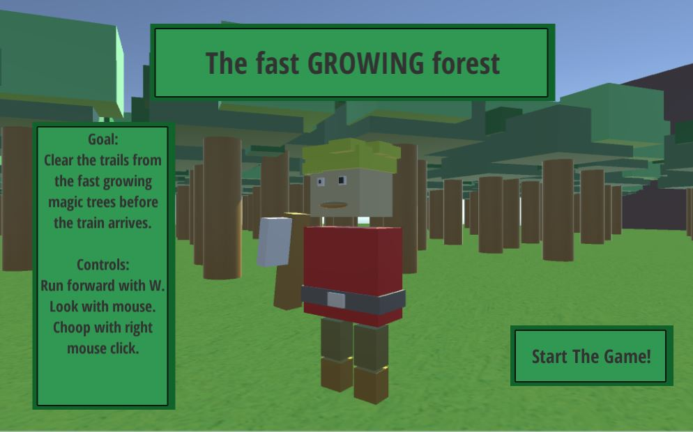
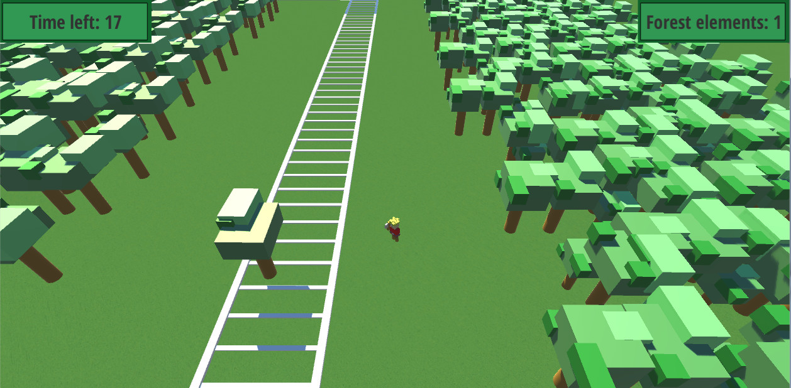
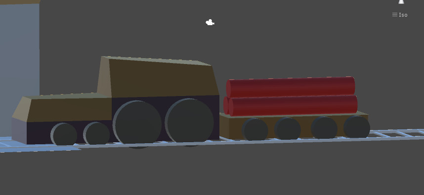
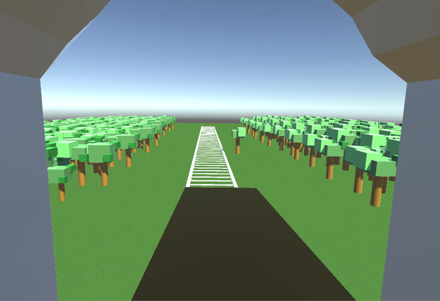

# Review of my second ludum dare

After making the painful experience from my first ludum dare, I have now also collected the second painful experience.

The Idea was to have a fast growing forest. In the forest there is a railroad with some problems. Yes, exactly, trees are growing on the railroad! You have to quickly chop down the trees, so when the train arrives, his load of TNT wont explode. The forester tool is in this case an axe, of course.

> The start screen with the player only existing with cubes from unity and yes there is an chop animation with his axe.

> Game overview. The trees were also only cube based made in unity, but they had an animation, so it looked like the trees where blowing in the wind.

> The train with the TNT!

> The idea was to have a sort of cut scene at the end of the game, where you could see the remaining trees.

It did a lot of fun to participate and this time I achieved more then the first time, so I would consider it as a sort of success.
