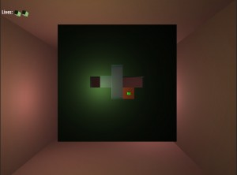
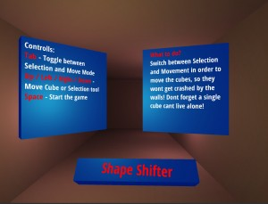

# Ludum-Dare
Finally! After the third time, I made it!

Move the cubes to the correct shape, so they will fit through the wall-shape:

This time I really came up fast with an idea, so I had much more time to develop instead of thinking about ideas. I also removed so many features as possible and tried to keep the idea just very simple.

My idea didn't come up from no where though. I remember a game on the PS1 called:

[Intelligent Cube IQ !](https:/www.youtube.com/watch?v=eqRrTZA5bfE)

It was also sort of about *shapeshifting* and it was very competitive to escape those cubes. So I tried something similar. But I think my game concept fits much better on a mobile device like **android** and **ios**, where you can swipe and touch in order to move the cubes. Many people had the feedback, that the control was a bit heavy and clumpsy, with I agree. In overall I must say that all the people were more then *friendly* and I was very happy about all the feedback I received! ♥

I enjoyed to participate and I hope you had also a lot of fun!

Greetz da schw3de